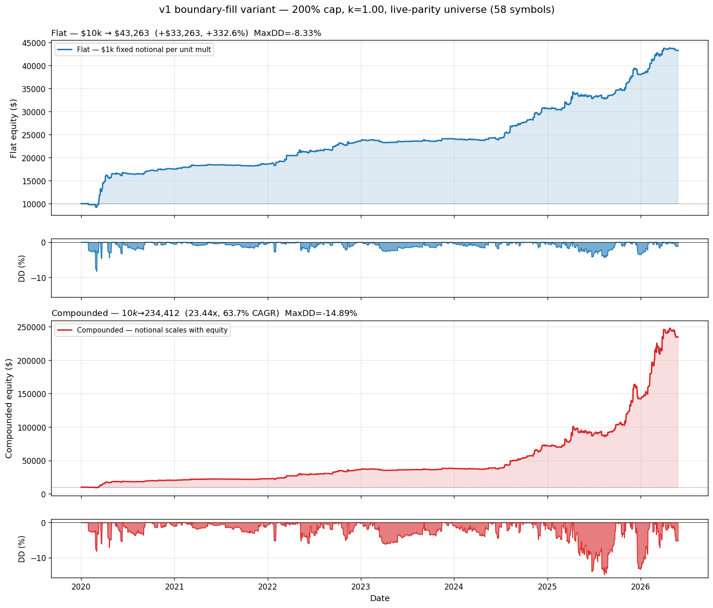

# ORB Live Trading System

Automated live execution of the Opening Range Breakout strategy across a
universe of leveraged and inverse ETFs.  Uses Interactive Brokers (IBClient)
for order routing and IB-native streaming (`reqRealTimeBars`, 5-sec bars).

## Architecture

```
orb_live/
├── config/           LiveConfig + StrategyConfig (all tunables in one place)
├── core/
│   ├── clock.py      MarketClock — RTH detection, half-day schedule, effective_close()
│   └── state_store.py  SQLite persistence (20 tables via SQLAlchemy Core)
├── data/
│   ├── ib_client.py       IB Gateway wrapper (IBClient, ib_async) — 5-sec real-time bars
│   └── underlying_data.py  Prior-session OHLCV via yfinance
├── signals/
│   ├── pre_market.py  Phase 1 (gap scan + PS filter) + Phase 2 (RTG + preflight)
│   └── ps_filter.py   Prior-session filter with per-symbol σ thresholds
├── execution/
│   ├── indicators.py      Rolling EMA state (seeded from ORB bars)
│   ├── order_policy.py    MarketableLimitPolicy with repeg + slippage guard
│   ├── position_manager.py  TP1/TP2/TP3/stop/EOD exit management
│   └── risk_gate.py       Session kill-switch + concurrent position limits
├── runner/
│   ├── bar_router.py    IB-native 5-sec bar streaming + missed-bar REST replay
│   ├── strategy_engine.py  State machine: WAITING → ORB_COMPLETE → IN_POSITION
│   └── session_runner.py   Top-level orchestrator (pre-market → trade → EOD)
└── ops/
    ├── health_check.py     HTTP server on :8080 (/health /status /positions /metrics)
    ├── alerts.py           Discord/Telegram/Slack webhook with rate limiting
    ├── long_term_logging.py  Daily rollup + monthly reports + log cleanup
    ├── quarterly_calibration.py  ADV baselines, metric drift, universe audit
    └── runbook.md          Operator manual
```

## Quickstart (paper trading)

```bash
# 1. Install
python -m venv .venv && source .venv/bin/activate
pip install -e .

# 2. Start IB Gateway / TWS in paper-trading mode

# 3. Run tests
python -m pytest orb_live/tests/ -q   # 453 tests, ~1s

# 4. Start session
python -m orb_live.runner.main --paper

# 5. Monitor
curl http://localhost:8080/status | python -m json.tool
```

See [DEPLOYMENT.md](DEPLOYMENT.md) for production VPS setup.

## Bar Dispatch (two paths)

The runner processes two bar streams from `BarRouter`, both fed by the same
IB 5-sec `reqRealTimeBars` feed:

**1. Entry path — `SessionRunner._on_entry_bar_dispatch` (every 5-sec bar).**
Post-ORB 5-sec bars are forwarded straight to the strategy engine for breakout
detection, so an entry fires the instant price crosses the ORB boundary rather
than waiting for the 1-min bar to close. It deliberately touches nothing else
(no cache/indicator/exit work). The first path to see the breakout flips the
symbol to `IN_POSITION`; the other then no-ops via the engine's state guard, so
running both is idempotent.

**2. Main path — `SessionRunner._on_bar_dispatch` (aggregated 1-min bar).**
Load-bearing order — do not reorder steps 2/3/4:

```
1. bar_cache.add_bar(symbol, bar)         — accumulate ORB window
2. indicators[symbol].on_bar(bar)         — EMA update  ← MUST precede step 3
3. position_manager.on_bar(symbol, bar)   — exit management reads current EMA
4. strategy_engine.on_bar(symbol, bar)    — entry detection (ORB_COMPLETE only)
```

Reordering steps 2 and 3 causes position manager to use a one-bar-stale EMA.
This invariant is enforced by `test_i_indicator_updated_before_position_manager`.

## Configuration

All strategy parameters live in `orb_live/config/live_config.py`.  Production
config is locked at:

### Backtest results (2020–2026, live-parity universe)

Live universe (58 symbols, drops BTFX + UBR as untradable/delisted). Sizing is
flat — $1,000 per unit of weight against a fixed $10,000 — so the dollar
figures do **not** scale to a live account, which sizes at
`base_notional_pct x current_equity` and compounds. Ratios carry over; dollars
do not.

**Current iteration** (2026-08-21). ETF gap basis, measured IB margin rates,
settled first-come with a margin budget of 1x equity:

| Metric | v1 locked | Current |
|--------|-----------|---------|
| Sharpe | 2.030 | 2.309 |
| Max Drawdown | -14.89% | -6.97% |
| Calmar | 4.27 | 8.30 |
| Flat P&L | $33,263 | $31,371 |
| Trades | 2,695 | 2,002 |

**Read that table carefully — most of the difference is not an improvement.**
Ablation, each row changing one thing from the row above
(`scripts/run_ablation.py`):

| step | trades | Sharpe | MaxDD | Net P&L | dDD |
|---|---|---|---|---|---|
| UL-basis sizing, all trades | 2,304 | 2.150 | -15.32% | $33,316 | — |
| + restrict to ETF-basis-covered trades | 2,022 | 2.313 | -10.51% | $32,178 | **+4.81** |
| + ETF-basis regime/cap_factor | 2,022 | 2.363 | -9.61% | $33,226 | +0.90 |
| no margin constraint (unpruned set) | 2,070 | 2.379 | -10.51% | $34,318 | -0.90 |
| + margin budget = 1x equity | 1,948 | 2.261 | -7.28% | $30,041 | **+3.23** |
| + drop unfillable siblings (cap 2.0) | 1,954 | 2.271 | -7.28% | $30,269 | **+0.00** |
| + partial entries | 2,002 | 2.309 | -6.97% | $31,371 | +0.31 |

Of the 8.35 points of drawdown improvement:

- **+4.81 (58%) is excluding trades live cannot select.** A correctness fix,
  not an edge gain. Those 282 trades were profitable but drawdown-heavy, so
  the v1 headline flattered a population that was never reachable.
- **+3.23 (39%) is the margin constraint holding fewer positions.** This
  *costs* performance: -$4,277 and Sharpe 2.379 -> 2.261. Lower drawdown from
  less exposure is not alpha; halving position size would do the same.
- **+0.31 (4%) is partial entries** and **+0.00 is the unfillable-sibling
  cap**, which is worth +$228 (+0.8%).

So the margin-aware selection work contributed almost nothing to the headline.
Its value is operational: live stops submitting ETHU/BTCZ shorts that IB
rejects, which currently land as unexplained `entry_rejected_or_unfilled`.

The honest summary is that v1's numbers were overstated, correcting the basis
raises Sharpe to ~2.37 because the unreachable trades were the risky ones, the
real margin ceiling then drags it to 2.261, and the margin work recovers about
half of that (+0.048 Sharpe, +$1,330).

#### What changed since the locked v1 config

1. **Candidate selection moved to the ETF gap basis.** The backtest measured
   the *underlying's* real overnight gap at a flat 2%; live measures the
   *ETF's own* gap at `leverage x 2%` and reconstructs a UL gap by dividing by
   leverage, because at 09:31 there is no settled daily bar for GDX — only a
   print for GDXU. The two disagree on 780 of 2,386 trades. Selecting the way
   live selects recovers 87.8% of engine trades against the old basis's 69.6%.

2. **GDXU was mislabelled 2x; it is 3x.** Measured by daily log-return
   regression against GDX: beta 2.99–3.11 with R² = 0.99 in every year since
   2021. Its live gap threshold was 4% instead of 6%.

3. **Margin rates are measured, not modelled.** FINRA 4210 minima match IB for
   conventional funds (NUGT 0.52 vs 0.50, TQQQ 0.79 vs 0.75, SQQQ short 0.95
   vs 0.90) but understate crypto by ~2x (XRPT 1.06, ETHD short 1.11) and
   crypto shorts by up to 7x (ETHU 4.09, ETU 3.99, BTCL 3.88, BTCZ 2.33).

4. **Unfillable siblings are dropped before skip-cheap** (`MAX_MARGIN_RATE`).
   A full-size ETHU short needs ~$39k of margin against ~$32k of available
   funds — impossible, not expensive. The backtest had booked 96 such trades.

5. **Partial entries.** A breakout that does not fit the remaining budget is
   sized down rather than dropped.

6. **The margin gate runs at all.** It was dead code: `prewarm_margin` sat
   behind a bar-cache read, and the market-data subscription that fills that
   cache is deliberately deferred until after that loop (IB line cap), so
   `_margin_budget` stayed `None` every session and only the raw buying-power
   floor applied.

Items 4 + 5 together were measured at +4.4% net P&L, Sharpe 2.261 → 2.309,
MaxDD -7.28% → -6.97% — i.e. they recover part of what the margin ceiling
costs, rather than improving on the unconstrained strategy. See the ablation
above before quoting these.

#### Allocation policy

Measured, budget 1x equity — live's existing first-come policy is the best of
the three and the constraint costs it 2%, not the 11–15% a scale-to-fit model
implied:

| Policy | Sharpe | Net P&L | vs unconstrained |
|---|---|---|---|
| unconstrained | 2.363 | $33,226 | — |
| scale-to-fit | 2.357 | $28,227 | -15.0% |
| **first-come (live)** | **2.383** | $32,550 | **-2.0%** |
| gap-ranked, reserve = P(fire) | 2.337 | $31,391 | -5.5% |

Reserving margin for a candidate that fires ~43% of the time loses more than
it protects, because margin only binds at the moment of entry for 1.8% of
entries. Selecting the cheapest-margin sibling outright was also rejected at
-40.2%: long is cheaper than short for 52 of 55 symbols, so it degenerates
into "never short", and shorts carry ~1.5x the edge per margin dollar.

#### What these numbers do NOT yet capture

- **12.2% of engine trades are unreachable** from the candidate set, despite
  both paths nominally using `leverage x 2%`. Unreconciled.
- **Fills are optimistic** — `entry_at_boundary` assumes every breakout fills
  at the ORB boundary. Live shows unexplained `entry_rejected_or_unfilled`
  events on conventional names where margin cannot be the cause.
- **Data quality**: the intraday cache is mixed Alpha Vantage / IBKR
  provenance with an unmeasured seam at 2026-06-16; split artifacts in the ETF
  cache are guarded, not fixed; WEBL is mapped to XLC (R² 0.73) rather than
  FDN (R² 0.98); FNGU's sigma rests on ~18 months of history.
- **Costs** use a mechanical CS+Amihud model, and partial entries book P&L
  linearly in size while paying a full spread and commission minimum.
- **The margin budget is static** at 1x equity; live reads AvailableFunds,
  which moves intraday with unrealised P&L.

### Strategy configuration

| Parameter | Value |
|-----------|-------|
| Universe | 58 symbols (C1 crypto, C2 gold/international/singles/VIX/GUSH, C3 broad leveraged ETFs + biotech + UNG) |
| ORB window | 30 min |
| Gap filter | 2% move on underlying (GAP_THRESHOLD) |
| PS filter k | 1.00σ (K_SIGMA) |
| Entry trigger | ORB high/low crossed on a **5-sec** real-time bar (`entry_at_boundary=True`); reactive by default. Optional pre-placed resting stop-limit mode (`use_resting_entries=True`) |
| Entry order | Marketable limit at `boundary ± (entry_buffer_orb_frac × ORB range)` — `entry_buffer_orb_frac=0.35`, auto-scales the fill room with each day's volatility (realized R:R ≈ 1.50 vs the 2.67 boundary-fill backtest) |
| EMA breakout gate | **Disabled** (`require_ema_confirmation=False`) |
| TP structure | TP1-only: 100% of position, class-based target (`tp1_target_multiple_by_class`) — **C1 (crypto) 2× ORB**, **C2/C3 1× ORB** — from boundary entry |
| Stop | midpoint of `orb_mid` and opposite ORB extreme (long: `(orb_mid + orb_low)/2`) |
| EOD flatten | 16:00 (`eod_exit_hour=16`, `eod_exit_minute=0`), lead `eod_flatten_lead_secs=60` |
| Base notional | **10% of live equity** per unit (`base_notional_pct=0.10`); falls back to fixed `v1_base_notional=$1,000` when equity is unavailable |
| Units cap | 20.0× (CAP_UNITS); gross exposure capped at `max_gross_exposure_pct=2.0` (200%) by the risk gate |
| Pruning | prune-all (skip-cheap-then-top-2 by prior daily close, applied to broad/BE as well) |
| Regime system | quiet (< 5 active underlyings), active (5–7), flood (≥ 8) |

**Operational upshot of the boundary-fill variant**: all three price levels (entry, stop, TP) are deterministic at 10:00 ET when the ORB completes. In the default reactive mode the entry limit is placed the moment a 5-sec bar crosses the boundary, with the stop and TP attached as OCA children; in `use_resting_entries` mode each candidate is instead submitted at 10:00 as a pre-placed stop-limit bracket. Either way, exits rest at IB (OCA stop-loss + take-profit) and residuals are flattened at ~15:59 ET (`eod_flatten_lead_secs`).

### Class × regime weight matrix

Structural 3-class × 3-regime causal sizing (locked 2026-06-20; cluster removed):

| Class | quiet | active | flood |
|-------|-------|--------|-------|
| **C1** (crypto) | 3.0 | 3.0 | 3.0 |
| **C2** (gold/intl/singles/VIX/GUSH) | 0.5 | 3.0 | 0.0 |
| **C3** (broad + sector pairs + biotech + UNG) | 3.0 | 3.0 | 3.0 |

`purity_skip = 1.0`. C2_flood=0 removes structurally unprofitable flood-day setups in the C2 class.

## Market Data Subscription Required

`IBClient.get_latest_quote()` raises `RuntimeError` if IB returns a degraded or
all-zero quote, rather than silently returning zeros and letting a session trade
on bad prices.

| Env var | Default | Purpose |
|---------|---------|---------|
| `IB_MARKET_DATA_TYPE` | `1` | IB data type: 1=live, 3=delayed |
| `IB_ALLOW_DELAYED_DATA` | (unset) | Set to `1` to permit delayed/zero quotes |

On `connect()`, IBClient registers an error handler for IB error code **10089**
(subscription required).  If 10089 fires, `_market_data_degraded` is set and
subsequent `get_latest_quote()` calls raise immediately.

`connect()` also calls `_validate_subscription()` which does a test quote on SPY.
If that raises `RuntimeError`, `connect()` translates it to `ConnectionError` so
the startup path fails loudly before any session begins.

To use delayed data intentionally (backtesting, monitoring without a live feed):

```bash
IB_ALLOW_DELAYED_DATA=1 IB_MARKET_DATA_TYPE=3 python -m orb_live.runner.main
```

## Operational Health

| Endpoint | Normal | Unhealthy |
|----------|--------|-----------|
| `/health` | 200 OK | 503 + reason |
| `/metrics` | Prometheus text | — |

During RTH, `/health` returns 503 if:
- Last bar received > 90 seconds ago
- Broker API not called in > 5 minutes
- `state_store.all_open_positions()` raises

## Operations

### Margin rate calibration

IB's house requirements move, so rates are re-measured live every session and
the stored table is only a fallback:

1. `prewarm_margin` runs at ORB close for every candidate, pricing a
   representative order through IB `whatIfOrder` (no order is placed). This is
   the source of truth for the session.
2. `master_universe.csv` (`margin_init_long/short`, `margin_maint_*`,
   `margin_measured`) is seeded into the manager before entries open, covering
   any symbol IB does not answer for.
3. An unknown symbol falls back to 1.0 — full notional — which over-reserves
   rather than silently over-trading.

Refresh the stored table periodically; a stale rate is worse than an honest
default because it looks authoritative:

```bash
# read-only: whatIf previews only, writes the CSV in both repos
python -m orb_live.scripts.measure_universe_margin --dry-run   # inspect first
python -m orb_live.scripts.measure_universe_margin
```

Note `BuyingPower` reads as 4x equity but is 4x **AvailableFunds**, which
positions deplete — it does not raise the ceiling. Effective capacity is ~1x
equity of initial margin, which at weight 3.0 is ~4 conventional positions or
~3 crypto ones.

### Sigma calibration

The prior-session filter uses sigma values (daily-return volatility) of each
underlying, thresholded at `sigma × ps_filter_k` (k = 1.00). Live loads these
**verbatim** from the vendored long-history file
`orb_live/strategy/data/sigma_master.csv` — the same multi-year file the
backtest uses. There is **no** rolling 30-day recompute at startup and nothing
is written to `sigma_runtime.yaml` (that path diverged 2–3× from the backtest
for some underlyings and silently shifted PS thresholds; it was removed).

Sigma methodology: `sigma = close.pct_change().dropna().abs().std()` over the
**full adjusted** (split/dividend-adjusted) daily history. Adjusted prices are
deliberate — raw closes carry reverse-split-day jumps that inflate sigma 2–3×
for names like XOP/GDXJ/MSTR.

To refresh the CSV (self-contained, yfinance only — previews by default):

```bash
python -m orb_live.scripts.refresh_sigma_master            # preview universe
python -m orb_live.scripts.refresh_sigma_master --confirm  # write
python -m orb_live.scripts.refresh_sigma_master --all      # every CSV row
```

Because sigma is measured over many years, a few weeks of new data barely moves
it — run this monthly/quarterly so values drift slowly without window noise.
Recomputed rows are merged into the CSV, preserving untouched underlyings; a
`>20%` move vs the current value is flagged (re-check the backtest if
unexpected). Parity between live and the CSV is locked by
`test_sigma_source_parity.py`. Per-symbol overrides can still be layered via
`config/sigma_override.yaml`.

## Tests

```bash
python -m pytest orb_live/tests/ -v
```

453 tests in ~1 second.  All synchronous — no broker credentials required.

Key test files:
- `test_session_runner.py` — bar dispatch order invariant, state machine, 5-sec entry path, equity-scaled sizing
- `test_half_day_session.py` — half-day schedule correctness
- `test_operational.py` — health server, alerts, daily rollup, drift detection
- `test_end_to_end_replay.py` — full session replay with synthetic bars
- `test_signal_parity.py` — backtest ↔ live parity for indicators and filters
- `test_sigma_source_parity.py` — live sigma is the CSV, bit-for-bit (no rolling recompute)
- `test_order_policy.py` — ORB-range entry buffer math

## Equity curves (2020–2026)

Flat ($1k fixed notional per unit multiplier) and compounded (notional scales
with equity) equity curves for the locked v1 boundary-fill variant on the
58-symbol live-parity universe. Drawdowns shown below each curve.



- Flat: $10k → $43,263 (+$33,263, +332.6%), MaxDD -8.33%
- Compounded: $10k → $234,412 (23.44×, 63.72% CAGR), MaxDD -14.89%
